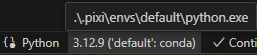
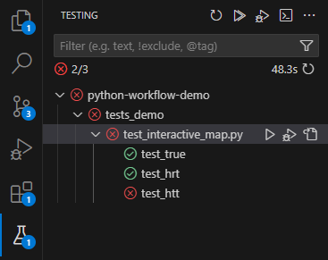
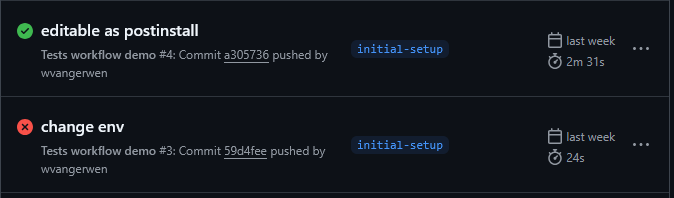

# Python workflow demo
[](https://github.com/hhnk/python-workflow-demo/actions/workflows/test_automatic.yml)

Standaard setup voor python-projects bij HHNK. In de repo staan een aantal voorbeelden van hoe een project ingericht kan worden waarmee makkelijk samengewerkt kan worden voor python ontwikkelwerk. 

Onderstaand staat uitgewerkt welke software wordt gebruikt, hoe testen opgezet kunnen worden, projectopzet en meer.

# IDE
Voor de developer environment zijn er veel opties, we gebruiken [Visual Studio Code](https://code.visualstudio.com/download). Dit biedt goede integratie van notebooks en tal van andere extensions. Uiteindelijk zal persoonlijke voorkeur ook meespelen in de keuze. Om samenwerking binnen het team te bevorderen maken we alleen gebruik van vs-code.

Overige IDE's\
Visual Studio Code Insiders [installer](https://code.visualstudio.com/insiders) - pre-releases, tegenwoordig niet zo meer nodig\
Cursor AI (https://www.cursor.com/) - Upcoming, vs-code based, maar vereist licentie, met juiste extensions kan deel ook in vs-code.
Spider - Mindere ervaring wat betreft Interactive terminal.
Jetbrains Pycharm - Ook wel goed, maar licententie nodig.

Zie [settings.json](https://github.com/HHNK/python-workflow-demo/.vscode/settings.json) voor standaard instellingen.

 Gebruikte extensions:
- Python
- Jupyter
- Ruff (code formatting / linting)
- Data Wrangler (DataFrames verkennen)

Optional
- Todo Tree ( # TODO highlights in code)
- autoDocstring - Python Docstring Generator (standaard format voor docstrings, bij gebrek aan copilot)
- Intellicode Completions (tab completions)
- Continue (lokaal AI code assistant, setup nodig)

Het is daarnaast nodig om de juiste python environment te selecteren om code te draaien, maar ook voor [code tests](#code-testing).
Makkelijkste route is op een willekeurig `.py` te openen en dan rechtsonder interpreter selecteren.
\
Anders kan het ook met `ctrl+shift+P` -> `Python: select interpreter`. Het kan zijn met een Pixi env dat die er niet tussen staat. Wanneer je vs-code opstart met de `vs-code.cmd` zou dit wel moeten werken.

Bij een mamba installatie kan het zijn dat de mamba installer niet in het windows path zit. Hiervoor kan in de vs code settings (`ctrl+shift+P`-> `Preferences: Open User Settings`) het condaPath worden opgegeven. Bijvoorbeeld:\
`"python.condaPath": "D:\\ProgramData\\miniforge\\Scripts\\conda.exe"`

# Env management
Meerdere opties. Zelf zijn we over aan het gaan naar Pixi vanaf Mamba.

### Conda

Standaard, let op;. gebruik channel `conda-forge` en NIET `default` ivm licentie, zie [is-conda-free](https://www.anaconda.com/blog/is-conda-free).

- env install `conda env create -f environment.yml`

### Mamba

Snellere conda. Ofwel [micromamba](https://mamba.readthedocs.io/en/latest/user_guide/micromamba.html) installer of [miniforge](https://github.com/conda-forge/miniforge)

- env install `mamba env create -f environment.yml`

### Poetry

- Bouwt op `pyproject.toml`. Pip env management met `poetry.lock`-files
- Werkende `pyproject.toml` files:
    - https://python-poetry.org/docs/basic-usage/
- env install: `poetry install`

### Pixi

- Bouwt op `pyproject.toml`. Conda+pip env management met `pixi.lock`-files. Lock-file moet in repo meegenomen worden.

    - https://prefix.dev/blog/pixi_for_scientists
    - https://pixi.sh/dev/switching_from/poetry/
    - https://stackoverflow.com/questions/70851048/does-it-make-sense-to-use-conda-poetry

- Werkende `pixi.toml` files

    - https://github.com/HHNK/python-workflow-demo/pixi.toml
    - https://github.com/threedi/hhnk-threedi-tools/pixi.toml
    - https://github.com/prefix-dev/pixi/blob/main/pixi.toml

- installer: https://pixi.sh/latest/advanced/installation/, dit zet een .exe neer voegt het `pixi` command aan het pad toe.
- env install: draai `pixi install`, `pixi update` in de cmd in het project. Elk command met `pixi` werkt de env bij naar wat er in de `pixi.toml` staat.
- Voor productie kan het goed zijn om de environment niet standaard bij te werken. In de [documentatie](https://pixi.sh/latest/workspace/lockfile/#when-is-a-lock-file-generated) is beschreven dat dit met de `--frozen` tag kan, of de `PIXI_FROZEN=true` environment variable.

## Editable installs
Ontwikkeling in meerdere packages tegelijk kan door deze te installeren als editable. Dit kan in de `pixi.toml` onder het kopje `[pypi-dependencies]`;\
`hhnk-research-tools = { path = "../hhnk-research-tools", editable = true }`\
Hierdoor worden aanpassingen in hhnk-reesarch-tools ook beschikbaar in dit project. Er is een kernel herstart nodig om de wijzigingen te zien, of met `importlib.reload` wat opzetten.

> [!WARNING]
> Momenteel (2025-04-01) wat issues om hiermee ook een github action aan te zetten op een linux machine. Om dit op te lossen zijn de directe editable installs in de `pixi.toml` commented. Om de env te laten werken moet `pixi run postinstall` gedraaid worden.


# Formatting en linting
Installeer [Ruff](https://docs.astral.sh/ruff/) als vs-code extentie en als dependency in de `pixi.toml`/`enviroment.yml`.

Gebruik formatting on save, voeg dit toe aan de `.vscode/settings.json`:

```json
"[python]": {
    "editor.defaultFormatter": "charliermarsh.ruff",
    "editor.formatOnSave": true,
    "editor.codeActionsOnSave": {
        "source.fixAll": "explicit"
    }
},
```

De `ruff` instelligen staan in de [pyproject.toml](https://github.com/HHNK/python-workflow-demo/pyproject.toml).

De defaults die we gebruiken over alle projecten zijn;

```toml
[tool.ruff]
# see https://docs.astral.sh/ruff/rules/ for meaning of rules
line-length = 119

#Exclude external packages in formatter
extend-exclude = [".pixi/*"]
include = ["*.py"]

[tool.ruff.lint]
select = ["D", "E", "F", "NPY", "PD", "C4", "I"]
ignore = ["D1", "D202", "D205", "D400", "D404", "E501", "PD002", "PD901"]
fixable = ["I"]

[tool.ruff.lint.pydocstyle]
convention = "numpy"

[tool.ruff.lint.per-file-ignores]
# Ignore unused imports in init
"__init__.py" = ["F401",  "I001"]

[tool.pylint]
disable = ["W1203"]
```

# Jupyter
We gebruiken de python interactive window, zie https://code.visualstudio.com/docs/python/jupyter-support-py voor uitleg. Komt erop neer dat we geen `.ipynb` nodig hebben en alles in `.py` kunnen ontwikkelen door middel van code cells gescheiden door: `# %%`. Dit is voor versiebeheer een must omdat `.ipynb` veel andere dingen dan code opslaat. Mocht je nog in een [juypterlab](https://jupyter.org/) omgeving in de browser werken, dan is de [jupytext](https://jupytext.readthedocs.io/en/latest/) een oplossing.

Zie `python_workflow_demo\nb_example.py` en `python_workflow_demo\nb_example.ipynb`.

Om de interactive window te gebruiken moet jupyter aanwezig zijn in de environment. Dit staat in de `pixi.toml` onder de dependencies

```toml
[dependencies]
jupyterlab = "*"
ipywidgets = "*"
```


# Logging
De `logging` module heeft wat setup nodig om lekker te werken in notebooks. Met name het toevoegen van [(Stream)Handlers](https://docs.python.org/3/library/logging.handlers.html) kan tijdens ontwikkeling wat lastig zijn. Om dit beter te stroomlijnen hebben we in [hhnk-research-tools](https://github.com/HHNK/hhnk-research-tools/blob/main/hhnk_research_tools/logger.py) een extra wrapper gemaakt.\
Zie `python_workflow_demo\log_levels.py` voor een voorbeeld.

# Project setup
Voor projecten zijn er vaak ook padverwijzingen nodig naar bestanden om te kunnen laden / schrijven. We hebben in [hhnk-research-tools](https://github.com/HHNK/hhnk-research-tools/tree/main/hhnk_research_tools/folder_file_classes) een aantal classes ontwikkeld om hier wat makkelijk mee om te kunnen gaan.

Hiermee kunnen we op een centrale plek eenmaal de paden defineren en gebruiken over alle scripts. Bijvoorbeeld het inladen van een gpkg:

```python
from python_workflow_demo.project import Project
p = Project(r"D:\github\wvangerwen\demo_data")
gdf = p.input.panden.load()
```

Voorbeelden van projectsetups
- `python_workflow_demo\project.py`
- https://github.com/threedi/hhnk-threedi-tools/blob/main/hhnk_threedi_tools/core/folders.py


# Code testing
Code tests zijn nodig om te controleren dat alles netjes blijft werken bij wijzigingen en maakt het veel makkelijker om code te controleren.
Dit kan via [pytests](https://docs.pytest.org/en/stable/) of [unittests](https://docs.python.org/3/library/unittest.html). Zelf gebruiken we pytests, niet echt een onderbouwde voorkeur, het werkt. Tests kunnen lokaal gedraaid worden en via een automatische workflow.

 Lokaal via het Testing menu in vs-code.
\


In deze repo staat een voorbeeld hoe een [Github Workflow](https://docs.github.com/en/actions/writing-workflows) opgezet kan worden om de tests te draaien wanneer een Pull Request op Github wordt gedaan. Dit staat in `.github\workflows\test_automatic.yml`. Een (werkende) yml toevoegen in deze map is genoeg om de action in te richten op Github, er is geen verdere configuratie nodig.
De resultaten zijn op de repo te zien onder [Actions](https://github.com/HHNK/python-workflow-demo/actions).
\

# Code coverage


# Version control


# Docker / Podman


# AI helpers
Zelf thuis een [Ollama](https://ollama.com/) installatie draaien waarmee je lokaal AI kan draaien. Met de [Continue](https://docs.continue.dev/getting-started/install) extension zijn code-hints mogelijk zonder de limieten van de free-tier van [Copilot](https://code.visualstudio.com/docs/copilot/overview). Hiervoor is wel een redelijke GPU nodig. Ervaring tot nu is net iets minder dan de online tools.